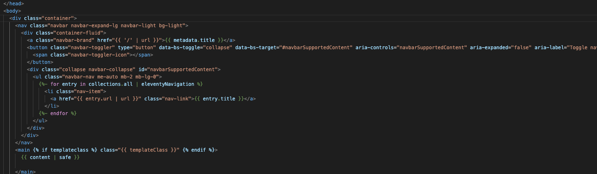

<figure class="figure">
  
  <figcaption class="figure-caption">
    This very website!
  </figcaption>
</figure>

  This is a
  <a href="https://jamstack.org">Jamstack</a>
  site, built using the
  <a href="https://www.11ty.dev">Eleventy</a>
  static site generator, and hosted on
  <a href="https://www.netlify.com">Netlify</a>. It's a work in progress, serving as a test-bed for - and demonstration of - the technologies I'm learning on the Coder's Guild JAMstack course:

<ul>
  <li>
    <a href="https://git-scm.com">Git</a>
    and
    <a href="https://github.com">GitHub</a>
  </li>
  <li>HTML, semantics and accessibility</li>
  <li>CSS and
    <a href="https://getbootstrap.com">Bootstrap</a>
  </li>
  <li>Static Site Generators</li>
  <li>HTML forms and processing them with
    <a href="https://www.netlify.com/products/forms/">Netlify Forms</a>
  </li>
  </ul>

  

  The source code for this site is <a href="https://github.com/rogfrich/eleventy-base-blog">available on GitHub</a>. It was forked from the official <a href="https://github.com/11ty/eleventy-base-blog">Eleventy base-blog</a> repo. 
  

